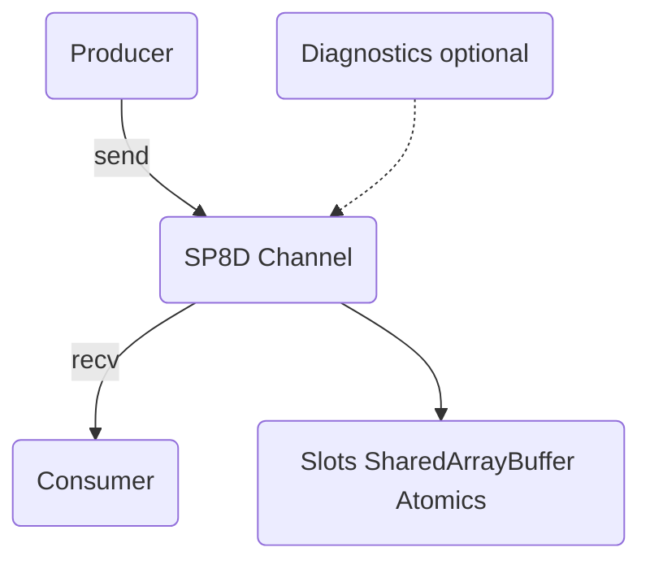

import { Callout } from "nextra/components";

# SP8D — Ultra-Low-Latency, Lock-Free Channels for Real-Time AI and Finance

> **The world’s first radically observable, lock-free, bounded protocol for cross-thread communication in browsers — designed for next-generation AI copilots, trading platforms, and multi-agent applications.**

---

## What is SP8D?

<Callout type="info" title="What is SP8D?">
  The world’s first radically observable, lock-free, bounded protocol for
  cross-thread communication in browsers — designed for next-generation AI
  copilots, trading platforms, and multi-agent applications.
</Callout>

SP8D is a breakthrough communication core for demanding front-end and AI workloads:

- **Blazing-fast, lock-free, slot-based communication** via SharedArrayBuffer and atomics
- **Truly bounded and backpressure-driven**, with guaranteed “never drop, never leak, never stall”
- **Battle-tested for real-time trading, ML agents, and browser-native concurrency**
- **Radically observable**: live diagnostics, transparency, and no more guessing why your system slowed down

Whether you’re wiring up AI copilots, streaming market data, or building the next layer of browser-native intelligence—SP8D gives you tools, proof, and performance the rest of the ecosystem can’t match.

---

## Instant Hello World (Browser/Node)

<Callout type="info" title="Instant Hello World">
  Try SP8D instantly in your browser or Node.js with this minimal example.
</Callout>

```ts copy showLineNumbers filename="hello-sp8d.ts"
import { createChannel } from "@sp8d/core";

const { channel } = createChannel({ slots: 8, slotSize: 64 }); // SPSC mode by default

// Producer
channel.send(new Uint8Array([1, 2, 3]));

// Consumer
const msg: Uint8Array | undefined = channel.recv(); // Uint8Array([1, 2, 3])
console.log(msg);
```

<sub>
  → See [Quickstart](../quickstart/common-recipes) for drop-in examples in
  Browser Workers.
</sub>

## Why SP8D?

Tired of slow, memory-leaky, or debugging-nightmare message passing?
Need guaranteed low-latency, fairness, and traceability under stress?
Building for regulated, high-stakes domains (finance, AI/ML, ops, browser concurrency)?
SP8D is designed for you.

## Where to Go Next

- [Quickstart Guide: Install, run and win in 5 minutes](/quickstart/installation)
- [Minimal Working Example: Copy, paste, and run instantly](/quickstart/minimal-example)
- [Core API Reference: Every method, every prop explained](/api-reference/channel-api)
- [Concurrency Models: SPSC, MPSC, MPMC at a glance](/principles/concurrency-models)
- [FAQ & Troubleshooting: “Why isn’t my message arriving?” and more](/guides-and-howtos/faqs#general)
- [Live Diagnostics & Benchmarking: Benchmark and observe SP8D live in your production environment](/examples/basic-spsc)
- Real-World Use Cases & Testimonials: SP8D in action (TODO)

## Architecture at a Glance



> **For live observability, add [`@sp8d/diagnostics`](https://www.npmjs.com/package/@sp8d/diagnostics) to any channel.**

## Get Involved 👋

Found a bug? Ideas to expand? Want to sponsor SP8D adoption in your stack?
Contribute or open issues — all feedback and help welcome.
Want to see the roadmap? Check our vision.
