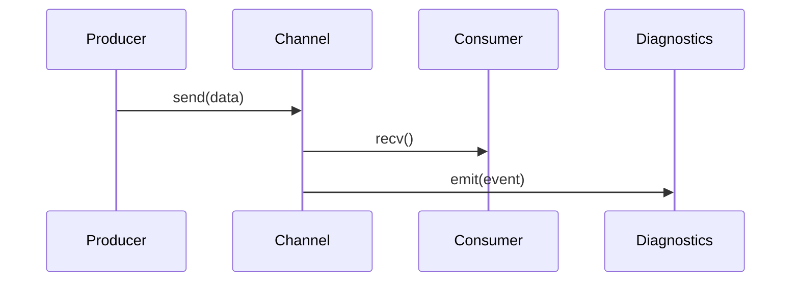

import { Callout } from "nextra/components";

**SP8D** is a high-performance, lock-free protocol for real-time, observable data transfer between concurrent agents in JavaScript and Node.js. It is designed for AI, finance, and multi-agent applications that demand speed, reliability, and transparency.

# What is SP8D? Lock-Free Real-Time Messaging for JavaScript & Node.js

> **SP8D** is a high-performance protocol for moving data instantly, reliably, and observably between concurrent agents in the browser or Node.js. Built for real-time web, AI, and finance, it solves the hardest concurrency problems—without compromise.

---

<Callout type="warning" title="Why Not postMessage?">
  Standard browser messaging APIs like <code>postMessage</code> and{" "}
  <code>MessageChannel</code> suffer from unpredictable latency, missed updates,
  and poor debuggability. SP8D is designed to solve these pain points for
  demanding, real-time applications.
</Callout>

## Why Not Just Use postMessage or MessageChannel?

- Slow and unpredictable latency
- Opaque: hard to debug and reason about
- Missed updates and lost messages
- Debugging nightmares

---

## What Makes SP8D Different?

<Callout type="info" title="What Sets SP8D Apart?">
  SP8D offers lock-free, slot-based concurrency, bounded memory, live
  diagnostics, and built-in recovery—making it uniquely suited for high-stakes,
  real-time, and multi-agent applications.
</Callout>

- **Lock-Free, Slot-Based Protocol:** Uses atomic operations for true parallelism—no server roundtrips, no event-loop blocking, no lock contention.
- **Bounded and Predictable:** Always a fixed memory footprint, explicit backpressure—no risk of memory leaks or runaway processes.
- **Segmented and Scalable:** Architected for many producers/consumers, scales linearly with your workload.
- **Radically Observable:** Live diagnostics for every slot, segment, and operation—see conflicts, errors, and lag in real time.
- **Battle-Tested Recovery:** Built-in recovery (sweeper) mechanism—survives thread death, browser hiccups, and adversarial loads.
- **AI-First and Finance-Ready:** Designed for demanding real-time and multi-agent flows, with specific integration points for AI, ML, and analytics.

---

## Who Is SP8D For?

- **AI Developers:** Need agent-to-agent or copilot collaboration, without postMessage pain.
- **Fintech Engineers:** Building ultra-low-latency trading, analytics, or compliance-sensitive UIs.
- **Web Performance Experts:** Who know why browser threads are a bottleneck, and want to break free.
- **Teams moving past MVP:** Where growth, reliability, and observability now matter as much as speed.

---

## When _Not_ to Use SP8D

<Callout type="warning" title="When Not to Use SP8D">
  SP8D is not ideal for unbounded message queues, trivial fire-and-forget comms,
  or environments lacking <code>SharedArrayBuffer</code> and{" "}
  <code>Atomics</code> support (very old browsers, strict CSP).
</Callout>

- Your app requires unbounded message queues or trivial best-effort “fire and forget” comms.
- You only have a single event producer and consumer and never expect contention.
- Browser SharedArrayBuffer and Atomics are not supported (very old browsers, highly restricted CSP).

---

## SP8D vs. postMessage, MessageChannel, and BroadcastChannel

<Callout type="info" title="Comparison Table">
  See how SP8D compares to standard browser messaging APIs in terms of
  performance, reliability, and observability.
</Callout>

Here’s how SP8D stacks up against common browser messaging APIs:

| Feature                 | postMessage  | MessageChannel | BroadcastChannel | SP8D |
| ----------------------- | ------------ | -------------- | ---------------- | ---- |
| Lock-free               | ❌           | ❌             | ❌               | ✅   |
| Bounded/Backpressure    | ❌           | ❌             | ❌               | ✅   |
| Observable/Diagnostics  | ❌           | ❌             | ❌               | ✅   |
| Predictable Latency     | ❌           | ❌             | ❌               | ✅   |
| Multi-producer/consumer | 🚫 (complex) | 🚫 (complex)   | ✅               | ✅   |

❌ = Not supported, 🚫 = Possible but complex

---

## How It Works

<Callout type="info" title="How It Works">
  Producers send data to the channel, which relays messages to consumers and
  emits live diagnostics for observability.
</Callout>

  <strong>Diagram:</strong> SP8D channels enable real-time, observable data flow
  between producers and consumers.

---

<Callout type="tip" title="Key Features">
  <ul>
    <li>
      <b>💡 Lock-Free:</b> No thread contention, ever.
    </li>
    <li>
      <b>🛡️ Bounded:</b> Never leaks, never stalls.
    </li>
    <li>
      <b>🔍 Observable:</b> See every event, live.
    </li>
  </ul>
</Callout>

- **Wait-free slot arbitration** for zero-contention access (no bottlenecks).
- **Efficient and safe message reclamation** ensuring no data is ever stuck or lost.
- Segment sharding for scalable concurrency.
- **Radical observability** through fine-grained, real-time tracking of errors, state, and performance.
- Max compatibility: Browser (WebWorker), Node.js (worker_threads), WASM

---

**Next: [Install SP8D in your project →](/quickstart/installation)**
