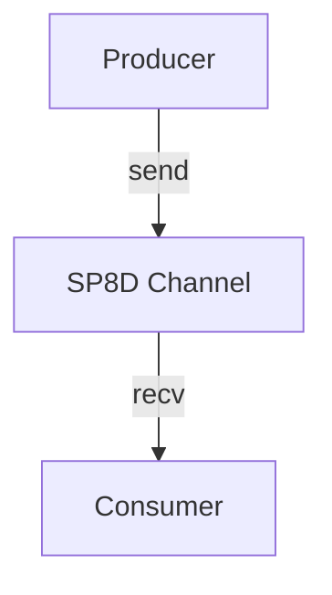
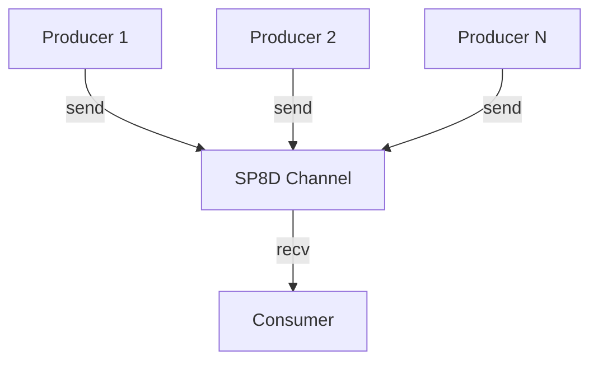
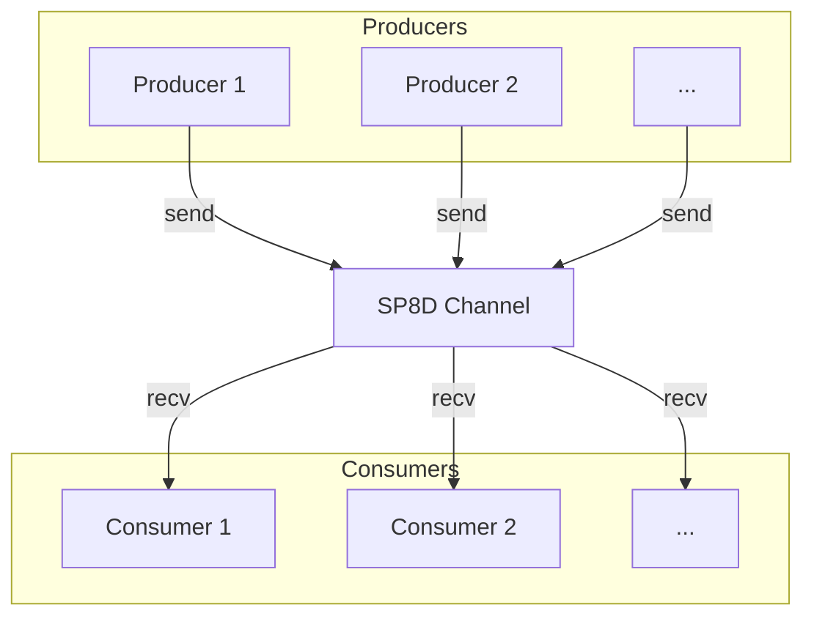

import { Callout } from "nextra/components";

# Concurrency Models: SPSC, MPSC, MPMC

SP8D supports all major cross-thread concurrency patterns out of the box, so you can pick the right one for your workload—**from ultra-low-latency pipelines to scalable, many-agent systems**.

---

## Quick Reference Table

<Callout type="info" title="Quick Reference">
  Use this table to quickly match your concurrency needs to the right SP8D
  channel model.
</Callout>

| Model | # Producers | # Consumers | Typical Use Case                        |
| ----- | ----------- | ----------- | --------------------------------------- |
| SPSC  | 1           | 1           | Sensor → Processor, UI event, SISO      |
| MPSC  | N           | 1           | Many workers → main aggregator          |
| MPMC  | N           | M           | Multi-agent, load-balancing, simulation |

---

## Single-Producer, Single-Consumer (SPSC)

<Callout type="info" title="Model Overview">
  SPSC is the simplest and fastest concurrency model—ideal for direct,
  one-to-one data flows where throughput and minimal contention are critical.
</Callout>



<sub>
  <strong>Diagram:</strong> One producer, one consumer. Highest throughput,
  minimal contention.
</sub>

### Key Points

- Highest throughput, minimal contention.
- Zero ambiguity: slots always move forward linearly.
- Great for: video/audio pipelines, UI events, one-off data flows.

<Callout type="tip" title="Not Ideal For">
  SPSC is **not ideal** for fan-in or fan-out scenarios. Use MPSC or MPMC for
  those patterns.
</Callout>

#### How to use

```ts copy
const { channel } = createChannel({ mode: "SPSC" });
```

[See the SPSC Example →](/examples/basic-spsc)

> **Looking for installation or setup?** See [Quickstart: Installation →](/quickstart/installation)

---

## Multi-Producer, Single-Consumer (MPSC)

<Callout type="info" title="Model Overview">
  MPSC lets you aggregate work from many sources into a single target—perfect
  for logging, worker pools, or parallel data collection.
</Callout>



<sub>
  <strong>Diagram:</strong> Multiple producers, one consumer. Good for parallel
  data collection, AI tasks fanning in, worker pool → main thread.
</sub>

### Key Points

- Multiple producers, single sink.
- Producers contend for slots — SP8D’s segments reduce collisions.
- Good for: parallel data collection, AI tasks fanning in to model, worker pool → main thread.

<Callout type="tip" title="Not Ideal For">
  MPSC is **not ideal** for multi-consumer or mesh scenarios. Use MPMC for those
  patterns.
</Callout>

#### How to use

```ts copy
const { channel } = createChannel({ mode: "MPSC", segments: 2 });
```

> **Need a minimal working code sample?** See [Quickstart: Minimal Example →](/quickstart/minimal-example)

---

## Multi-Producer, Multi-Consumer (MPMC)

<Callout type="info" title="Model Overview">
  MPMC is the most flexible model, supporting many producers and many
  consumers—ideal for load-balancing, multi-agent systems, or simulations at
  scale.
</Callout>



<sub>
  <strong>Diagram:</strong> Many producers, many consumers. True concurrent mesh
  for multi-agent, load-balancing, or simulation workloads.
</sub>

### Key Points

- True concurrent mesh: many-in, many-out.
- Perfect for multi-agent AIs, trading engines, any "work distributed among many actors."
- Segmentation is critical for high contention/low latency.

<Callout type="tip" title="Not Ideal For">
  MPMC is **not ideal** for simple point-to-point or single-sink scenarios. Use
  SPSC or MPSC for those patterns.
</Callout>

#### How to use

```ts copy
const { channel } = createChannel({ mode: "MPMC", segments: 4 });
```

> **Want real-world integration code?** See [Quickstart: Common Recipes →](/quickstart/common-recipes)

---

## How to Choose?

<Callout type="info" title="Choosing the Right Model">
  Unsure which model to use? Match your use case to the recommended model below.
</Callout>

| Your Need:                     | Recommended Model |
| ------------------------------ | ----------------- |
| Point-to-point data            | SPSC              |
| Fan-in (best for logging, etc) | MPSC              |
| Multi-agent, load balancing    | MPMC              |

<Callout type="tip" title="Scaling with Segments">
  Segmentation reduces contention and enables scaling—set{" "}
  <code>segments &gt; 1</code> for multiple producers or consumers. Map each{" "}
  <code>producerId</code> or <code>consumerId</code> to a segment to further
  reduce slot collisions.
</Callout>

## Interop & Scaling

_Segmentation reduces contention and enables scaling—set `segments > 1` for multiple producers or consumers. Map each `producerId` or `consumerId` to a segment to further reduce slot collisions._

[See segmentation deep-dive →](/guides-and-howtos/faqs)

> **Looking for protocol internals or slot state machine details?** See [Slot State Machine →](/guides-and-howtos/faqs)

## Code Patterns in Practice

_Choose the right model for your architecture:_

- **Single-thread to worker:** SPSC
- **Several AI inferences → UI:** MPSC
- **Market sim, multi-copilot:** MPMC

[See integration recipes →](/quickstart/common-recipes)

---
