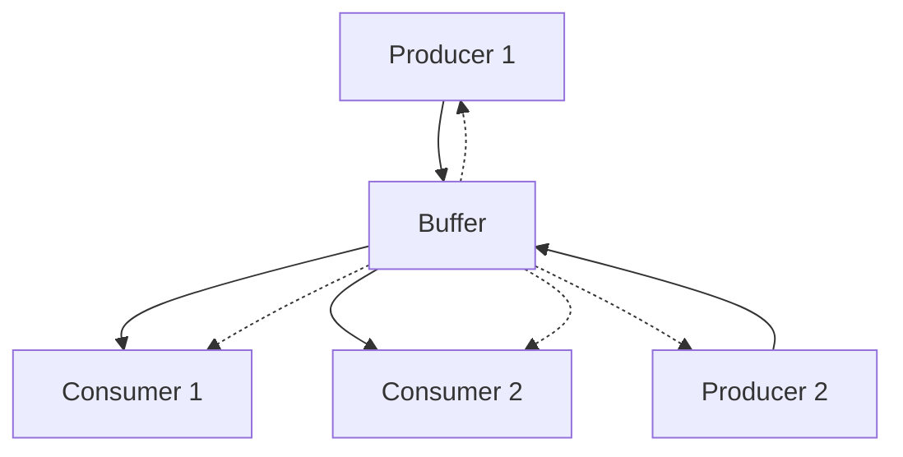

import { Callout } from "nextra/components";

Fairness and backpressure are the backbone of robust, lock-free messaging in SP8D. Mastering these concepts ensures your SP8D-powered apps remain fast, reliable, and responsive—even under heavy load or contention.

# Fairness & Backpressure in SP8D

> SP8D’s approach to fairness and backpressure makes high-performance concurrency “just click.” This page will show you how and why.

## What Are Fairness & Backpressure?

Backpressure occurs when a channel’s buffer is full and cannot accept more data until space is freed. In SP8D, this means a producer must wait or retry if the consumer is too slow.

- **Real-world analogy:** Like a traffic jam—if the road (buffer) is full, new cars (messages) can’t enter until others exit.
- **Why it matters:** Without backpressure handling, you risk data loss, unresponsive apps, or runaway memory usage.

Fairness ensures that all producers and consumers get a fair chance to access the channel, preventing starvation and priority inversion.

- **Starvation:** When one agent never gets access because others dominate the channel.
- **Priority inversion:** When a lower-priority agent blocks a higher-priority one.

---

## Visualizing Fairness & Backpressure

### Buffer States



<sub className="diagram-caption">
  <strong>Diagram:</strong> Producers push messages into the buffer and
  consumers pop them out. Dashed lines represent backpressure (buffer full) or
  wait/retry (buffer empty) signals, ensuring all agents interact fairly with
  the buffer.
</sub>

<Callout type="info" title="How to Read This Diagram">
  Producers push messages into the buffer. If the buffer is full, backpressure
  is signaled to producers (dashed lines). Consumers pop messages; if the buffer
  is empty, they must wait or retry. SP8D coordinates access to ensure fairness
  for all agents.
</Callout>

### Slot State Machine Fairness

For a complete explanation of how SP8D's slot state machine enforces fairness, round-robin access, and prevents starvation—including diagrams, advanced scenarios, and troubleshooting—see the [Slot State Machine](/protocol-internals/slot-state-machine#advanced-scenarios-multi-segment-mpmc-and-contention) documentation.

---

## How SP8D Ensures Fairness & Handles Backpressure

SP8D’s protocol is designed to:

- **Detect and signal backpressure** when a buffer is full or empty.
- **Enforce fairness** so no agent is starved or unfairly delayed.

### Quick Reference: Signals & Actions

| Scenario            | Producer Sees    | Consumer Sees    | What to Do             |
| ------------------- | ---------------- | ---------------- | ---------------------- |
| Buffer Full         | Signal/Exception | —                | Retry, yield, or wait  |
| Buffer Empty        | —                | Signal/Exception | Retry, yield, or wait  |
| Starvation Detected | Diagnostics      | Diagnostics      | Tune pattern or buffer |

<Callout type="warning" title="Buffer Full?">
  If you see a buffer full error, your consumer may be too slow or your buffer
  size too small. Consider tuning your workflow or increasing buffer capacity.
</Callout>

---

### Best Practices & Usage Patterns

#### Handle backpressure

<Callout type="info" title="Backpressure in Action">
  Use async iteration or retry logic when a buffer is full.
</Callout>

```ts copy showLineNumbers filename="backpressure-example.ts"
for await (const msg of channel) {
  try {
    // process message
  } catch (err) {
    // handle error, e.g. diagnostics or retry
  }
}
// or
while (!channel.send(data)) {
  await new Promise((r: (value: void) => void) => setTimeout(r, 1)); // yield and retry
  if (channel.diagnostics) {
    console.log(channel.diagnostics()); // inspect buffer state
  }
}
```

#### Monitor diagnostics

<Callout type="info" title="Diagnostics in Action">
  Use SP8D’s diagnostics to spot fairness or backpressure issues early.
</Callout>

```ts copy showLineNumbers filename="diagnostics-example.ts"
if (channel.diagnostics) {
  const diag = channel.diagnostics();
  if ((diag as { starvation?: boolean }).starvation) {
    console.warn("Potential starvation detected:", diag);
  }
}
```

- **Tune buffer size:** Match your buffer size to your workload for optimal throughput.
- **Pattern selection:** Choose the right concurrency model (SPSC, MPSC, MPMC) for your use case.

<Callout type="warning" title="Pro Tip">
  Use diagnostics and live monitoring to catch fairness or backpressure issues
  before they impact production.
</Callout>

See: [Common Recipes](/quickstart/common-recipes), [Concurrency Models](/principles/concurrency-models)

---

## What To Do

<Callout type="info" title="Do">
  <strong>Do</strong>
  - Monitor for buffer full/empty signals and respond appropriately.
  - Use diagnostics to detect and resolve fairness issues.
  - Tune your buffer size and concurrency pattern for your workload.

</Callout>

## What To Avoid

<Callout type="error" title="Don't">
  <strong>Don't</strong>
  - Ignore repeated buffer full/empty signals.
  - Assume fairness is automatic in all concurrency models—verify with diagnostics.
  - Overlook the impact of slow consumers or producers.

</Callout>

---

## Troubleshooting: What If Things Go Wrong?

<Callout type="warning" title="Troubleshooting">
  For in-depth troubleshooting scenarios—including persistent buffer full,
  starvation, and advanced diagnostics—see the [SP8D Troubleshooting
  Guide](/guides-and-howtos/troubleshooting).
</Callout>

---

## Advanced Scenarios: Fairness & Backpressure in the Real World

Explore how SP8D handles challenging, real-world concurrency and contention scenarios that go beyond the basics.

### Multi-Producer, Multi-Consumer (MPMC) Fairness

In high-contention MPMC setups, multiple producers and consumers may compete for buffer slots, risking unfairness or starvation.

```ts copy showLineNumbers filename="mpmc-fairness.ts"
// Simulate multiple producers/consumers
const NUM_PRODUCERS = 8;
const NUM_CONSUMERS = 8;
// ...channel setup...
// Each producer/consumer runs in its own thread or worker
```

<Callout type="info" title="How SP8D Handles This">
  SP8D’s slot state machine ensures round-robin access, so no producer or
  consumer can monopolize the buffer—even under heavy contention.
</Callout>

### Bursty Workloads & Buffer Thrashing

Bursty traffic can cause the buffer to oscillate rapidly between full and empty, increasing the risk of backpressure and dropped throughput.

```ts copy showLineNumbers filename="bursty-workload.ts"
// Producer sends bursts of messages
for (let i = 0; i < 1000; i++) {
  channel.send(burstData());
  if (i % 100 === 0) await sleep(10); // simulate burst pause
}
```

<Callout type="info" title="Best Practice">
  Tune buffer size to absorb bursts, and use diagnostics to monitor for repeated
  backpressure signals. Consider smoothing input if possible.
</Callout>

### Starvation Edge Cases

Pathological scheduling or unlucky timing can cause one agent to be starved, even in a fair system.

```ts copy showLineNumbers filename="starvation-edge.ts"
// One slow consumer, many fast producers
while (true) {
  if (channel.hasData()) {
    process(channel.receive());
    await sleep(100); // slow consumer
  }
}
```

<Callout type="warning" title="How to Detect & Fix">
  Use diagnostics to detect starvation (e.g., one agent not making progress).
  Consider rebalancing workloads or increasing consumer count.
</Callout>

### Priority Inversion & Mitigation

A low-priority agent can block a high-priority one if not managed carefully.

```ts copy showLineNumbers filename="priority-inversion.ts"
// High-priority and low-priority producers
if (isHighPriority) {
  // try to send first, or use a separate channel
}
```

<Callout type="info" title="SP8D Solution">
  Use separate channels for different priorities, or implement a priority-aware
  scheduler on top of SP8D if needed.
</Callout>

### Mixed Concurrency Patterns

Combining SPSC and MPMC channels in a pipeline can introduce subtle fairness or backpressure issues.

```ts copy showLineNumbers filename="mixed-patterns.ts"
// SPSC for stage 1, MPMC for stage 2
const stage1 = createSPSC();
const stage2 = createMPMC();
// ...pipeline setup...
```

<Callout type="info" title="Best Practice">
  Monitor each stage independently. Use diagnostics to ensure no stage becomes a
  bottleneck or source of unfairness.
</Callout>

### Anti-Patterns & What to Avoid

- Relying on buffer size alone to solve fairness or backpressure.
- Ignoring diagnostics or repeated backpressure signals.
- Using a single MPMC channel for all traffic when separation by priority or stage would be clearer.

---

## Key Takeaways

- SP8D’s fairness and backpressure mechanisms are robust even in advanced, real-world scenarios.
- Diagnostics are your best tool for detecting and resolving subtle issues.
- Design your channel topology and buffer sizes with your workload’s contention and burstiness in mind.

---

## Where to Go Next

- [Channel API Reference](/api-reference/channel-api)
- [Common Recipes](/quickstart/common-recipes)
- [Protocol Architecture Overview](/protocol-internals/architecture-overview)
- [FAQ & Troubleshooting](/guides-and-howtos/faqs)
