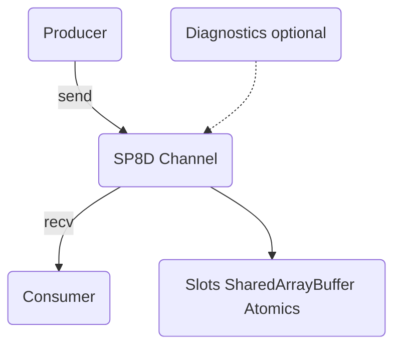
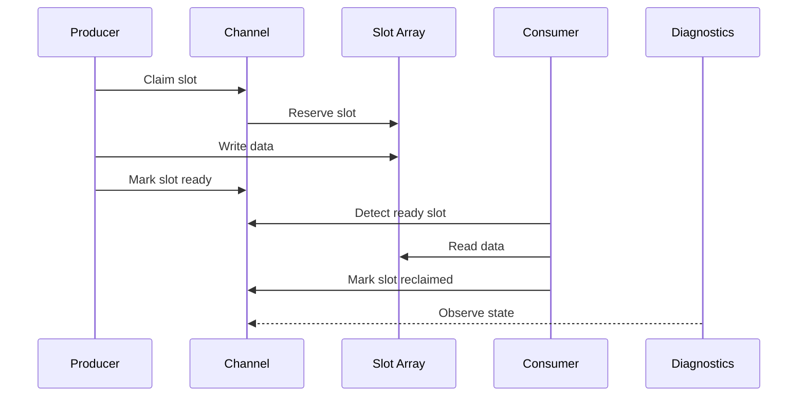
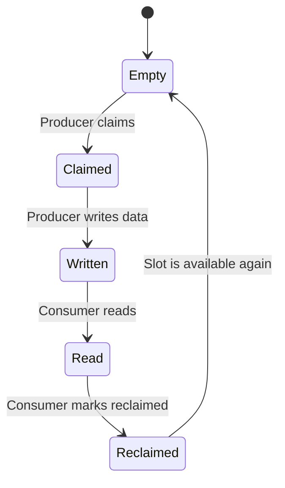
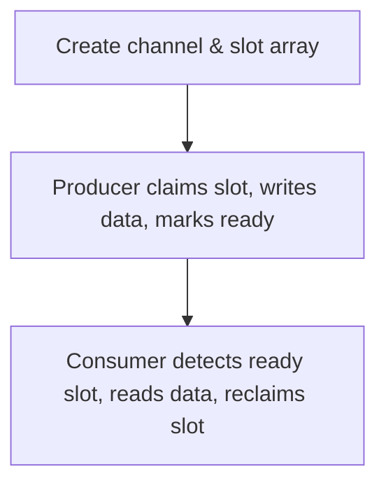

import { Callout } from "nextra/components";

SP8D’s protocol internals are the foundation for its lock-free, ultra-low-latency messaging. This page provides a concise, visual, and practical overview of how the protocol works under the hood, so you can confidently build, debug, or extend SP8D-powered systems.

# SP8D Protocol Internals: Architecture Overview

<Callout type="success" title="Why SP8D?">
  SP8D delivers lock-free, ultra-low-latency, and observable messaging for
  demanding AI, finance, and multi-agent applications—outperforming legacy
  approaches like postMessage.
</Callout>

<Callout type="info" title="Who is this for?">
  This page is for advanced users, implementers, and contributors who want to
  understand the inner workings of SP8D. It provides a high-level, visual, and
  narrative-driven overview of the protocol’s architecture and data flow.
</Callout>

## What you'll learn

    - How SP8D’s protocol architecture enables lock-free, ultra-low-latency
      messaging
    - The role and lifecycle of each core component
    - How observability and robustness are built in
    - Where to go for deep dives and advanced troubleshooting

<Callout type="info" title="When to read this">
  Read this after the Quickstart, before diving into protocol internals or
  debugging edge cases.
</Callout>

---

## Architecture at a Glance

<Callout type="info" title="Real-World Use Case">
  <strong>AI Copilots:</strong> SP8D powers real-time, multi-agent communication
  in browser-based AI copilots, ensuring fairness and traceability under load.
</Callout>



<sub class="diagram-caption">
  **Diagram:** SP8D protocol architecture. See legend below for numbered
  components.
</sub>

**Legend:**

1. **Producer**: Sends data/messages into the channel
2. **Channel**: Lock-free protocol core, manages slots and state transitions
3. **Slot Array**: Shared memory buffer (SharedArrayBuffer) divided into slots
4. **Consumer**: Receives data/messages from the channel
5. **Diagnostics**: (Optional) Observes, monitors, and reports channel health

---

## Key Components

**SP8D’s architecture is built from five core components:**

| Component       | Description                                                  | Why it matters / Pitfalls                                             | Learn more                                                   |
| --------------- | ------------------------------------------------------------ | --------------------------------------------------------------------- | ------------------------------------------------------------ |
| **Producer**    | Sends data/messages into the channel                         | Entry point for all data; incorrect usage can cause stalls            | [Quickstart](/quickstart/minimal-example)                    |
| **Channel**     | Lock-free protocol core, manages slots and state transitions | Ensures safety and performance; misconfiguration can cause contention | [Slot State Machine](/protocol-internals/slot-state-machine) |
| **Slot Array**  | Shared memory buffer (SharedArrayBuffer) divided into slots  | Core of lock-free design; buffer sizing is critical                   | [Gen-Cycle Byte](/protocol-internals/gen-cycle-byte)         |
| **Consumer**    | Receives data/messages from the channel                      | Must keep up to avoid lag/backpressure                                | [Fairness & Backpressure](/principles/fairness-backpressure) |
| **Diagnostics** | Optional: observes, monitors, and reports channel health     | Enables live debugging and recovery                                   | [Diagnostics FAQ](/guides-and-howtos/faqs)                   |

---

## Protocol Workflow: Step-by-Step

**How a message moves through SP8D:**



<sub class="diagram-caption">
  **Diagram:** Protocol workflow: each step from producer claim to consumer
  reclaim, with diagnostics observing state transitions.
</sub>

<Callout type="info" title="Atomic Operations">
  Each step is managed by atomic operations to guarantee safety and performance
  under concurrency.
</Callout>

1. **Producer** claims a free slot in the shared buffer.
   <em>What could go wrong?</em> Buffer full, no slots available. <strong>
     SP8D:
   </strong> Backpressure/fairness logic prevents starvation.
2. **Producer** writes data and marks the slot as ready.
   <em>What could go wrong?</em> Partial writes, race conditions. <strong>
     SP8D:
   </strong> Atomic state transitions guarantee safety.
3. **Channel** manages state transitions and ensures lock-free handoff.
   <em>What could go wrong?</em> State corruption. <strong>SP8D:</strong> Protocol
   enforces valid transitions only.
4. **Consumer** detects ready slot, reads data, and marks slot as reclaimed.
   <em>What could go wrong?</em> Consumer lag, missed messages. <strong>
     SP8D:
   </strong> Diagnostics and lag stats help detect issues.
5. **Diagnostics** (optional) observes slot states, throughput, and errors in real time.

---

## Slot State Machine (Preview)

**Slot lifecycle at a glance:**

Each slot in the buffer has a lifecycle—think of it like a rotating sushi bar, where each plate (slot) is claimed, filled, picked up, and returned for reuse.



<sub class="diagram-caption">
  **Diagram:** Slot state transitions in SP8D. See [Slot State
  Machine](/protocol-internals/slot-state-machine) for full details, or [try the
  live test harness](https://harness.sp8d.com).
</sub>

---

## Observability & Diagnostics

**Monitor, debug, and optimize in real time:**

<Callout type="info" title="Real-World Use Case">
  <strong>Finance:</strong> SP8D’s diagnostics enable live monitoring and
  recovery in high-frequency trading and regulated environments.
</Callout>

SP8D is designed for radical observability. The diagnostics module can be attached to any channel to monitor:

- Slot usage and state
- Throughput (messages/sec)
- Consumer lag
- Errors and conflicts

```ts copy showLineNumbers
import { createChannel, createChannelDiagnostics } from "@sp8d/core";
const { channel } = createChannel({ slots: 16, slotSize: 64 });
const diagnostics = createChannelDiagnostics(channel, 100);
diagnostics.onUpdate((stats) => {
  console.log("SP8D Stats:", stats);
});
diagnostics.start();
```

<Callout type="info" title="Why Observability Matters">
  Live diagnostics help you detect stuck slots, backpressure, and concurrency
  issues before they impact production.
</Callout>

<details>
  <summary>Show sample diagnostics output</summary>

```json
{
  "used": 2,
  "throughput": 1200,
  "consumerLag": 0,
  "errors": 0,
  "conflicts": 0,
  "reclaimed": 1
}
```

</details>

<Callout type="tip" title="How to enable diagnostics">
  Use `createChannelDiagnostics(channel, intervalMs)` to monitor any channel in
  real time.
</Callout>

---

## Edge Cases & Robustness

**SP8D is designed for real-world reliability:**

- **Stuck slots:** Automatic sweeper and diagnostics detect and recover.
  _How to detect:_ Diagnostics show non-zero `used` with no throughput.
  _How to recover:_ Sweeper reclaims stuck slots; manual intervention rarely
  needed.
- **Reclaim races:** Protocol ensures only one consumer can reclaim a slot.
  _How to detect:_ Diagnostics may show `conflicts`.
  _How to recover:_ Protocol prevents double-reclaim; review consumer logic
  if persistent.
- **Full/empty buffer:** Backpressure and fairness mechanisms prevent starvation.
  _How to detect:_ Diagnostics show high `used` or `consumerLag`.
  _How to recover:_ Tune buffer size or consumer speed; see [Fairness & Backpressure](/principles/fairness-backpressure).

For implementation details, see `sp8d-core.ts` and `sp8d-diagnostics.ts`.

---

## Practical Example: Mapping Code to Architecture

**See the protocol in action.** Try this in your project or in the [SP8D live test harness](https://harness.sp8d.com):

```ts copy showLineNumbers
import { createChannel } from "@sp8d/core";
const { channel } = createChannel({ slots: 8, slotSize: 64 });
channel.send(new Uint8Array([1, 2, 3]));
const msg = channel.recv();
```



<sub class="diagram-caption">
  **Diagram:** Step-by-step: (1) Channel creation, (2) Producer action, (3)
  Consumer action.
</sub>

---

## Where to Go Next

**Continue your SP8D journey:**

- [Slot State Machine →](/protocol-internals/slot-state-machine): Deep dive into slot lifecycle, transitions, and edge cases.
- [Gen-Cycle Byte →](/protocol-internals/gen-cycle-byte): Learn about the gen-cycle byte and its role in protocol safety.
- [Fairness & Backpressure →](/principles/fairness-backpressure): Understand how SP8D ensures fairness and handles full/empty buffers.
- [Troubleshooting →](/guides-and-howtos/troubleshooting): Solutions for common issues, diagnostics, and recovery.
- [Scalable MPMC Example →](/examples/scalable-mpmc): See a real-world, parallel multi-producer/multi-consumer scenario in action.
