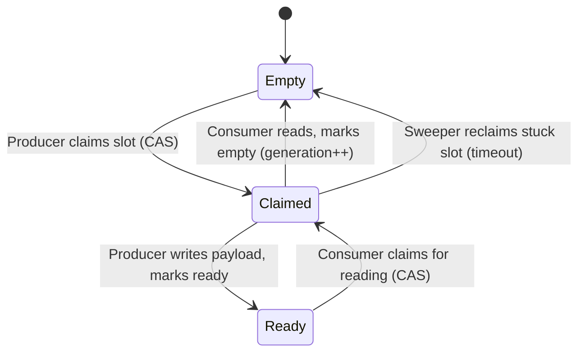
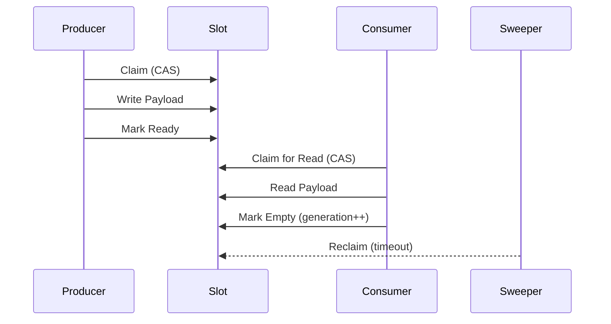
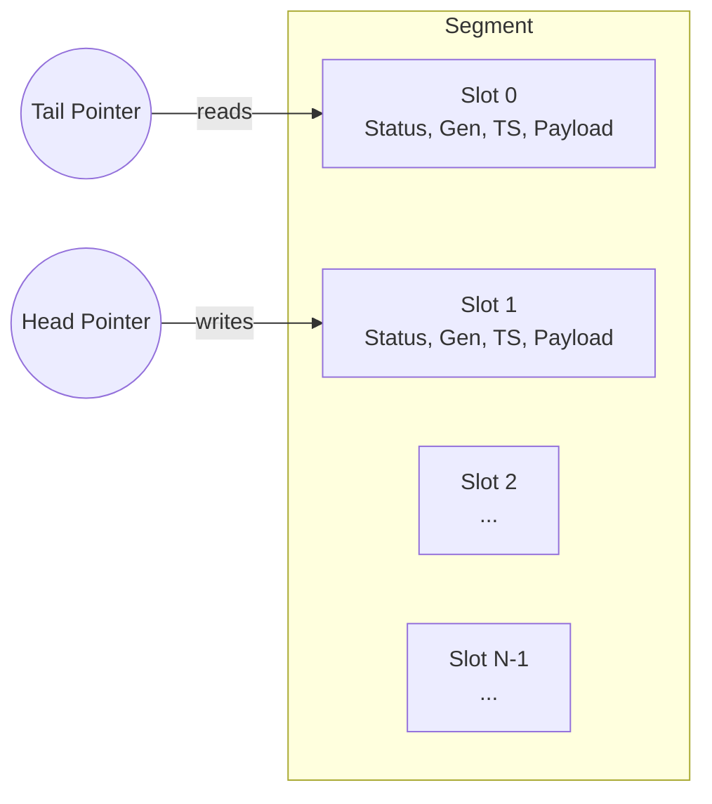
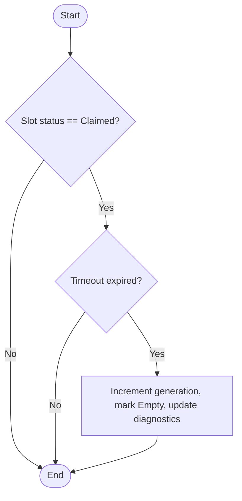

import { Callout } from "nextra/components";

SP8D’s slot state machine is the engine that powers its lock-free, high-performance message passing. This page provides a deep, practical, and visual guide to the slot lifecycle, state transitions, fairness, and recovery—essential for advanced users, implementers, and anyone extending or debugging the protocol.

# Slot State Machine: The Heart of SP8D

> <strong>Who should read this?</strong> Advanced users, protocol implementers, and
> anyone debugging or extending SP8D internals. This page is your canonical, up-to-date
> reference for the slot state machine: the core of SP8D’s lock-free protocol.

---

## Quick Reference: Slot States & Transitions

| State   | Code Value | Description                 | Allowed Transitions | Atomic Operation                |
| ------- | ---------- | --------------------------- | ------------------- | ------------------------------- |
| Empty   | 0          | Slot is available for claim | → Claimed           | CAS (Producer)                  |
| Claimed | 1          | Slot is being written/read  | → Ready, → Empty    | CAS (Producer/Consumer/Sweeper) |
| Ready   | 2          | Slot contains a message     | → Claimed           | CAS (Consumer)                  |

- <strong>CAS</strong>: Compare-and-swap via <code>Atomics.compareExchange</code>
- <strong>Generation Tag</strong>: Incremented on reclaim/wraparound to prevent
  <a href="/guides-and-howtos/faqs#what-is-the-aba-problem">ABA problems</a> and
  enables safe wraparound ABA

---

## What is a Slot?

A **slot** is a fixed-size region in the shared buffer that holds a single message. Each slot has:

- **Status**: Empty, Claimed, or Ready
- **Generation (Cycle) Tag**: Prevents ABA problems and enables safe wraparound
- **Claim Timestamp**: For diagnostics and recovery
- **Payload**: The actual message data

---

## Slot Lifecycle & State Transitions



<sub
  className="diagram-caption"
  aria-label="Diagram: Slot state machine. Transitions between Empty, Claimed, and Ready, with atomic operations and sweeper recovery."
>
  <strong>Diagram:</strong> Slot state machine: transitions between Empty,
  Claimed, and Ready, with atomic operations and sweeper recovery.
</sub>

---

## Visual: Message Flow Through the Slot State Machine



<sub
  className="diagram-caption"
  aria-label="Diagram: Step-by-step message flow. Producer claims and writes, consumer claims and reads, sweeper reclaims if needed."
>
  <strong>Diagram:</strong> Step-by-step message flow: producer claims and
  writes, consumer claims and reads, sweeper reclaims if needed.
</sub>

---

## Step-by-Step: State Transitions in Code

Below is a simplified TypeScript walkthrough of the slot state machine, based on the actual <code>sp8d-core.ts</code> implementation:

```ts copy showLineNumbers
// Pseudocode for slot state transitions
function producerClaim(slot) {
  // Atomically claim an empty slot
  if (Atomics.compareExchange(slot.status, 0, 1) === 0) {
    // Write payload, set ready
    slot.payload = ...;
    Atomics.store(slot.status, 2); // Ready
  }
}

function consumerClaim(slot) {
  // Atomically claim a ready slot
  if (Atomics.compareExchange(slot.status, 2, 1) === 2) {
    // Read payload, mark empty and increment generation
    const data = slot.payload;
    slot.generation++;
    Atomics.store(slot.status, 0); // Empty
    return data;
  }
}

function sweeperReclaim(slot, now) {
  // If slot is stuck in Claimed too long, reclaim
  if (slot.status === 1 && now - slot.claimTimestamp > sweepTimeoutMs) {
    slot.generation++;
    Atomics.store(slot.status, 0); // Empty
    // Update diagnostics
  }
}
```

<Callout type="warning" title="Best Practice">
  Always use atomic operations for state transitions. Never write directly to{" "}
  <code>status</code> except via <code>Atomics</code>.
</Callout>

---

## State Definitions

- **Empty (`STATUS_EMPTY = 0`)**: Slot is available for a producer to claim.
- **Claimed (`STATUS_CLAIMED = 1`)**: Slot is being written (by producer) or read (by consumer). No other agent may access.
- **Ready (`STATUS_READY = 2`)**: Slot contains a message, ready for a consumer to claim.

---

## Atomic Operations & Fairness

- **Claiming a slot**: Producers and consumers use `Atomics.compareExchange` to move a slot from Empty→Claimed or Ready→Claimed, ensuring lock-free, wait-free access.
- **Generation Tag**: Incremented on each wraparound or reclaim, preventing stale reads/writes and enabling robust recovery.
- **Head/Tail Pointers**: Each segment tracks its own head (producer) and tail (consumer) for round-robin fairness.

---

## Sweeper: Automatic Recovery

If a slot is stuck in Claimed (e.g., a thread dies mid-operation), the **sweeper** detects and reclaims it after a timeout (`sweepTimeoutMs`):

- Increments generation tag
- Marks slot as Empty
- Updates diagnostics (`reclaimed`, `errors`)

<Callout type="info" title="Why Sweeping Matters">
  Without the sweeper, a single stuck thread could permanently block a slot,
  reducing throughput and breaking fairness.
</Callout>

---

## Visual: Slot Array Anatomy



<sub
  className="diagram-caption"
  aria-label="Diagram: SP8D segment ring buffer. Head points to the next slot to write, Tail to the next slot to read. Slots contain status, generation, timestamp, and payload."
>
  <strong>Diagram:</strong> SP8D segment ring buffer. <strong>Head</strong>{" "}
  points to the next slot to write, <strong>Tail</strong> to the next slot to
  read. Slots contain status, generation, timestamp, and payload.
</sub>

---

## Best Practices & Gotchas

- **Never skip status transitions**: Always use atomic CAS for state changes.
- **Monitor diagnostics**: High `conflicts` or `reclaimed` counts may indicate contention or stuck agents.
- **Tune `sweepTimeoutMs`**: Too low may cause false reclaims; too high may delay recovery.
- **Use generation tags**: Always check generation if implementing custom consumers/producers.

---

## Advanced Scenarios: Multi-Segment, MPMC, and Contention

- **Multi-Segment Scaling**: Each segment is an independent ring buffer, enabling scalable MPSC/MPMC patterns. Producers and consumers are mapped to segments for load balancing.
- **Contention Handling**: High contention is mitigated by round-robin head/tail pointers and atomic slot claims. Monitor `conflicts` in diagnostics to detect hotspots.
- **Fairness**: The protocol ensures round-robin fairness by advancing head/tail pointers per segment. Starvation is prevented by the sweeper and diagnostics.

```ts copy showLineNumbers
// Example: Mapping producer/consumer IDs to segments
const segment = segments[agentId % segments.length];
// Each agent operates on its assigned segment for reduced contention
```

<Callout type="info" title="Best Practice">
  For high-throughput workloads, increase the number of segments to reduce
  contention and improve fairness.
</Callout>

---

## Troubleshooting

- **Stuck slots**: Check for high `reclaimed` or `errors` in diagnostics.
- **Starvation**: Ensure all agents are making progress; use diagnostics to detect lagging segments.
- **Protocol violations**: Use `.validate()` to check for invalid slot states or generations.

---

## Troubleshooting & Debugging Checklist

- [ ] **Stuck slots**: Check diagnostics for high `reclaimed` or `errors`. Use `.validate()` to inspect slot states.
- [ ] **Starvation**: Ensure all agents are making progress; lagging segments may indicate contention or misconfiguration.
- [ ] **Protocol violations**: Use `.validate()` and review slot generation tags for inconsistencies.
- [ ] **Performance issues**: Monitor `conflicts` and tune segment count and `sweepTimeoutMs`.
- [ ] **Custom extensions**: Always use atomic operations and check generation tags when implementing custom logic.

<Callout type="warning" title="Debugging Tip">
  Use the diagnostics API and `.validate()` method regularly during development
  and in production monitoring.
</Callout>

---

## Sweeper & Recovery: Flowchart and Checklist



<sub
  className="diagram-caption"
  aria-label="Diagram: Sweeper flowchart. Shows how stuck slots are detected and reclaimed."
>
  <strong>Diagram:</strong> Sweeper flowchart: detects stuck slots and reclaims
  them after timeout.
</sub>

**Recovery Checklist:**

- [ ] Monitor diagnostics for high `reclaimed` or `errors` counts
- [ ] Tune `sweepTimeoutMs` for your workload
- [ ] Ensure generation tags increment on reclaim
- [ ] Validate slot state after recovery (use `.validate()`)

<Callout type="warning" title="Common Pitfall">
  Setting `sweepTimeoutMs` too low can cause false reclaims; too high can delay
  recovery. Always test with your real workload.
</Callout>

---

## Reference Implementation: Annotated Code

See the canonical implementation in [`sp8d-core.ts`](https://github.com/SP8D/sp8d/blob/master/packages/core/src/sp8d-core.ts):

```ts copy showLineNumbers
// Example: Producer claim logic (simplified)
if (Atomics.compareExchange(slot.status, STATUS_EMPTY, STATUS_CLAIMED) === STATUS_EMPTY) {
  // Write payload, set ready
  slot.payload = ...;
  Atomics.store(slot.status, STATUS_READY);
}

// Example: Consumer claim logic (simplified)
if (Atomics.compareExchange(slot.status, STATUS_READY, STATUS_CLAIMED) === STATUS_READY) {
  // Read payload, mark empty and increment generation
  const data = slot.payload;
  slot.generation++;
  Atomics.store(slot.status, STATUS_EMPTY);
}
```

---

## Where to Go Next

- [Protocol Architecture Overview](/protocol-internals/architecture-overview)
- [Gen-Cycle Byte](/protocol-internals/gen-cycle-byte)
- [Channel API Reference](/api-reference/channel-api)
- [Common Recipes](/quickstart/common-recipes)
- [Fairness & Backpressure](/principles/fairness-backpressure)
- [FAQ & Troubleshooting](/guides-and-howtos/faqs)
