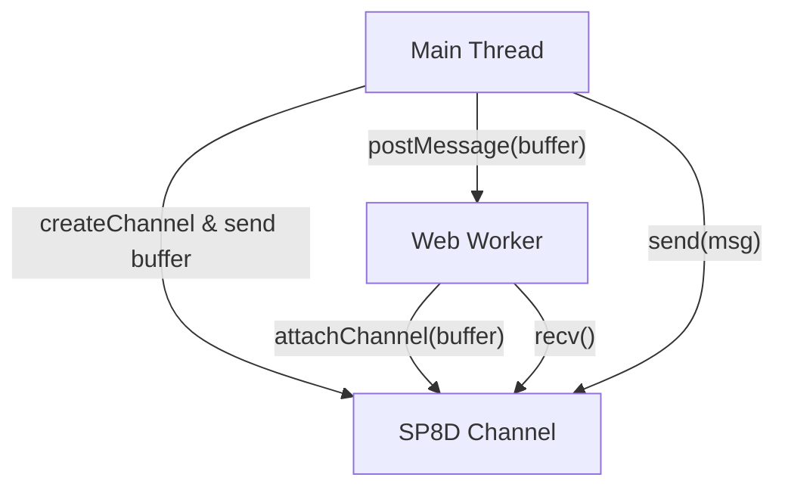
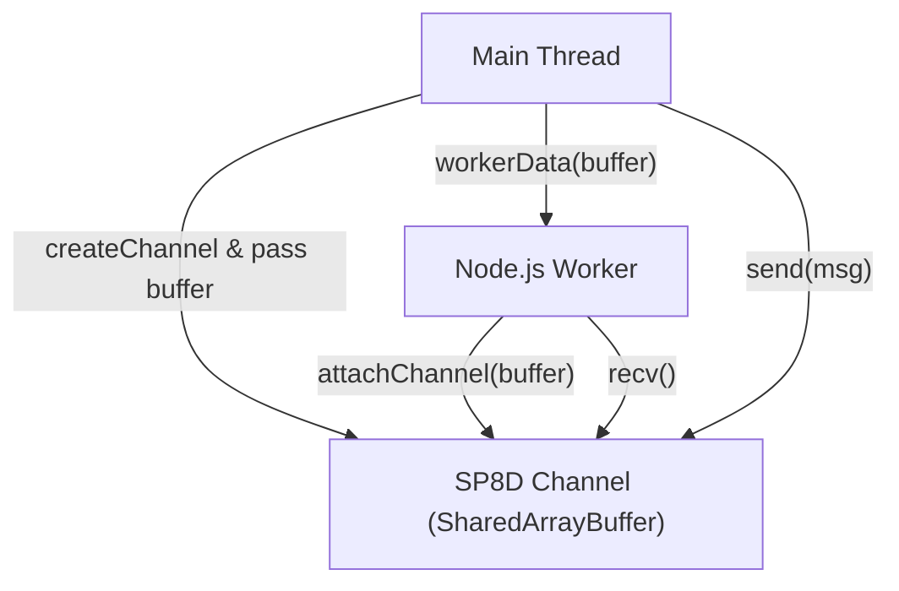
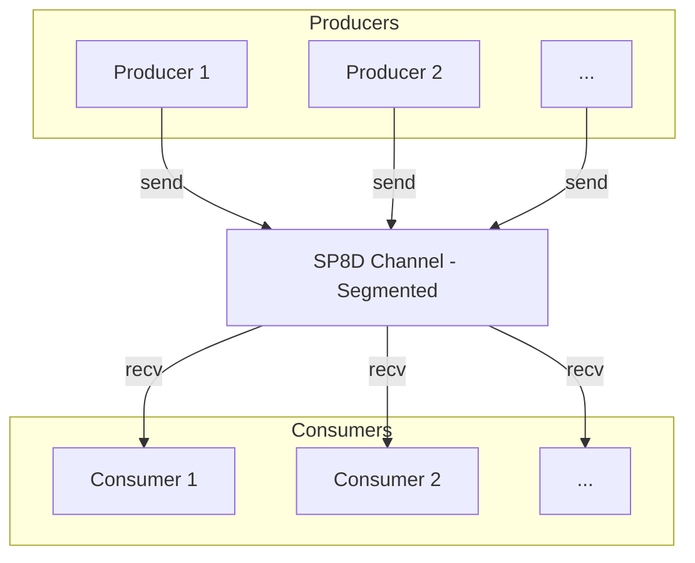
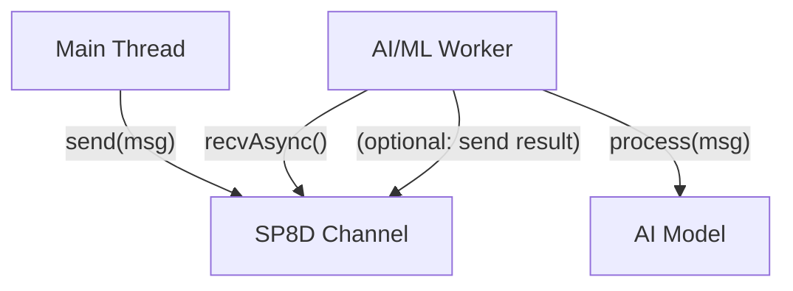

import { Callout } from "nextra/components";

SP8D’s common recipes are your practical, copy-paste guide to integrating high-performance channels into real-world JavaScript and Node.js apps. This page provides actionable patterns for browser, Node.js, and AI/ML workflows, with diagrams and troubleshooting tips to help you build robust, scalable systems fast.

# SP8D Recipes: Integration Patterns for JavaScript & Node.js

> **Unlock SP8D’s superpowers**: copy-paste these patterns to integrate channels across workers, threads, AI loops, and dashboards. Each recipe below is ready to use and includes a visual or explanation to help you understand the data flow and integration points.

---

## Pattern Selection Guide

| Use Case                           | Pattern   | When to Use                          | Recipe Link                                                            |
| ---------------------------------- | --------- | ------------------------------------ | ---------------------------------------------------------------------- |
| Main thread ↔ Web Worker (browser) | SPSC/SPSC | One producer, one consumer, browser  | [Browser Recipe](#in-a-browser-main-thread-to-worker)                  |
| Main thread ↔ Worker (Node.js)     | SPSC/SPSC | One producer, one consumer, Node.js  | [Node.js Recipe](#nodejs-with-worker_threads)                          |
| Multiple producers/consumers       | MPSC/MPMC | Scale out, reduce contention         | [Multiplexing](#multiplexing-multiple-producers-one-or-many-consumers) |
| AI/ML model integration            | Async     | Offload to model worker, async flows | [AI/ML Recipe](#integrating-with-ml-or-ai-model-workers)               |
| Diagnostics & monitoring           | Any       | Debug, monitor, tune                 | [Diagnostics](#using-diagnostics--stats)                               |
| Backpressure handling              | Any       | Buffer full, retry, async            | [Backpressure](#handling-backpressure-full-buffer)                     |

---

## Quick Reference: Common Patterns

- **SPSC (Single-Producer, Single-Consumer):** Fastest, simplest, use for 1:1 thread comms.
- **MPSC/MPMC (Multi-Producer/Consumer):** Use for scaling, fairness, and contention reduction.
- **Async/AI/ML:** Use async iteration and workers for model inference or event-driven flows.
- **Diagnostics:** Always monitor stats in staging/production for best results.
- **Backpressure:** Always handle buffer full/empty signals to avoid data loss or stalls.

---

## In a Browser (Main Thread to Worker)

This pattern enables high-performance, zero-copy communication between your main thread and a Web Worker. The main thread creates the channel and buffer, transfers it to the worker,
and both communicate through the shared channel.

<Callout type="warning" title="Requirements">
  Requires SharedArrayBuffer support in your browser.
</Callout>



<sub className="diagram-caption">
  <strong>Diagram:</strong> Browser: main thread and worker communicate via a
  shared SP8D channel.
</sub>

```ts copy showLineNumbers filename="main.ts"
import { createChannel } from "@sp8d/core";

const { channel, buffer } = createChannel({ slots: 16, slotSize: 32 });
const worker = new Worker("worker.js");
worker.postMessage(buffer, [buffer]);
channel.send(new Uint8Array([99, 100, 101]));
```

```ts copy showLineNumbers filename="worker.ts"
import { attachChannel } from "@sp8d/core";

self.onmessage = (e: MessageEvent<SharedArrayBuffer>) => {
  const channel = attachChannel(e.data);
  const msg = channel.recv();
  console.log("Worker received:", msg); // Uint8Array([99, 100, 101])
};
```

---

## Node.js with worker_threads

This recipe shows how to use SP8D for fast, lock-free communication between Node.js worker threads. The main thread creates the channel and buffer, passes it to the worker, and
both communicate through the shared channel.

<Callout type="warning" title="Requirements">
  Requires Node.js 18+ and <code>worker_threads</code>.
</Callout>



<sub className="diagram-caption">
  <strong>Diagram:</strong> Node.js: main thread and worker communicate via a
  shared SP8D channel.
</sub>

```ts copy showLineNumbers filename="main.ts"
import { createChannel } from "@sp8d/core";
import { Worker } from "worker_threads";

const { channel, buffer } = createChannel({ slots: 32, slotSize: 32 });
const worker = new Worker("./worker.js", { workerData: buffer });
channel.send(new Uint8Array([123]));
```

```ts copy showLineNumbers filename="worker.ts"
import { workerData } from "worker_threads";
import { attachChannel } from "@sp8d/core";

const channel = attachChannel(workerData);
const msg = channel.recv();
console.log("Worker received:", msg); // Uint8Array([123])
```

---

## Multiplexing: Multiple Producers, One or Many Consumers

This pattern enables scalable, concurrent communication by using segments or multiple channels. Each producer/consumer pair can be in its own worker.



<sub className="diagram-caption">
  <strong>Diagram:</strong> Multiplexing: multiple producers and consumers with
  a segmented SP8D channel.
</sub>

<Callout type="info" title="Data Flow">
  Each producer and consumer can operate in its own thread or worker, mapped to
  segments for fair sharing and reduced contention.
</Callout>

```ts copy showLineNumbers
// In each producer thread:
channel.send(new Uint8Array([myProducerId]));

// In each consumer thread:
while (true) {
  const msg = channel.recv();
  if (msg) process(msg);
}
```

> For fair sharing and less contention, map producer/consumer IDs to segments using <code>(id % segments)</code> when creating the channel.

---

## Integrating with ML or AI Model Workers

This recipe demonstrates how to use SP8D for efficient, async message passing to and from ML/AI model workers. The main thread sends data to the worker, which processes it (e.g., with an ML
model) and can optionally send results back.



<sub className="diagram-caption">
  <strong>Diagram:</strong> AI/ML integration: main thread sends data to a
  worker for model inference via SP8D channel.
</sub>

<Callout type="info" title="Custom Model Integration">
  Replace <code>runMyMLModel</code> with your own model inference function.
</Callout>

```ts copy showLineNumbers filename="ai-worker.ts"
import { attachChannel } from "@sp8d/core";

let channel;
self.onmessage = (e) => {
  channel = attachChannel(e.data);
};

async function processMessages() {
  while (true) {
    const msg = await channel.recvAsync(); // waits for a message
    const result = await runMyMLModel(msg); // user-defined
    // Optionally, send result back via another channel
  }
}
processMessages();
```

---

## Using Diagnostics & Stats

Monitor health and performance in real time with SP8D diagnostics.

```ts copy showLineNumbers
import { createChannel, createChannelDiagnostics } from "@sp8d/core";

const { channel } = createChannel({ slots: 16, slotSize: 64 });
const diagnostics = createChannelDiagnostics(channel, 100);

diagnostics.onUpdate((stats) => {
  console.log("SP8D Stats:", stats);
});
diagnostics.start();
```

<Callout type="info" title="Stats Explained">
  Stats include: <code>.used</code> (msgs in flight), <code>.throughput</code>{" "}
  (msgs/sec), <code>.consumerLag</code>, <code>.errors</code>,{" "}
  <code>.conflicts</code>, <code>.reclaimed</code>.
</Callout>

---

## Handling Backpressure (Full Buffer)

This pattern shows how to handle cases where the buffer is full and the producer must wait or retry.

```ts copy showLineNumbers
// Producer waits if buffer is full
const payload = createPayload();
while (!channel.send(payload)) {
  // Buffer is full, wait a bit or drop/log as needed
  await new Promise((r) => setTimeout(r, 1));
}
```

<Callout type="warning" title="Backpressure Handling">
  If the buffer is full, the producer must wait, retry, or drop messages as
  appropriate for your workload.
</Callout>

---

## Common Pitfalls & Troubleshooting

<Callout type="warning" title="Common Pitfalls">
  <ul>
    <li>
      <strong>Buffer full, send fails:</strong> Always check the return value of{" "}
      <code>send()</code> and handle backpressure (see{" "}
      <a href="#handling-backpressure-full-buffer">Backpressure</a>).
    </li>
    <li>
      <strong>Wrong concurrency mode:</strong> Use SPSC for 1:1, MPSC/MPMC for
      scaling. Mismatched mode can cause errors.
    </li>
    <li>
      <strong>SharedArrayBuffer issues:</strong> Ensure browser/Node.js supports
      it and transfer buffers correctly.
    </li>
    <li>
      <strong>Diagnostics not enabled:</strong> Use diagnostics in staging to
      catch issues early.
    </li>
    <li>
      <strong>Async gotchas:</strong> Use <code>sendAsync</code> and{" "}
      <code>recvAsync</code> for non-blocking flows; avoid busy-wait in
      production.
    </li>
    <li>
      <strong>Segment mapping:</strong> For fairness, map IDs to segments using{" "}
      <code>id % segments</code>.
    </li>
  </ul>
</Callout>

For advanced troubleshooting, see the [SP8D Troubleshooting Guide](/guides-and-howtos/troubleshooting) and [Slot State Machine Troubleshooting](/protocol-internals/slot-state-machine#troubleshooting--debugging-checklist).

---

## Where to Go Next

- [Minimal Example](/quickstart/minimal-example)
- [Channel API Reference](/api-reference/channel-api)
- [Protocol Architecture Overview](/protocol-internals/architecture-overview)
- [Fairness & Backpressure](/principles/fairness-backpressure)
- [FAQ & Troubleshooting](/guides-and-howtos/faqs)
