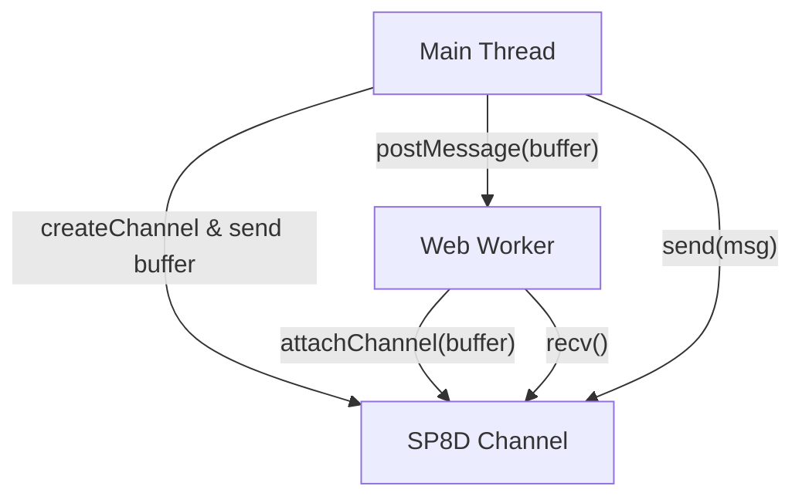
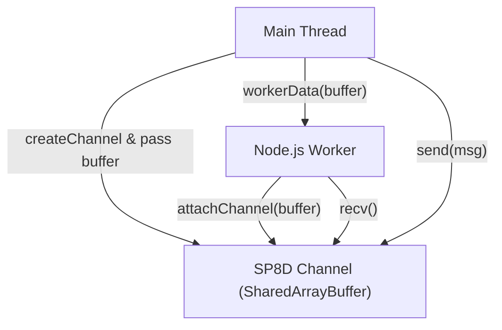
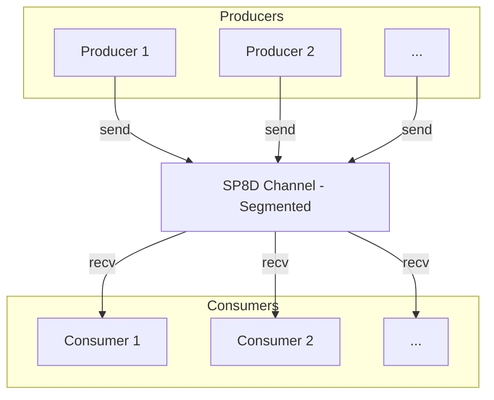
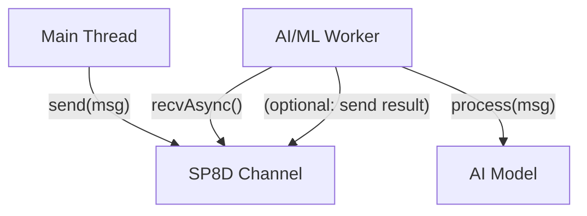

import { Callout } from "nextra/components";

# Quickstart: Common Recipes

Unlock SP8D’s power with common integration patterns and recipes for JavaScript and Node.js. Learn browser, Node.js, and AI/ML workflows with code samples and diagrams for high-performance messaging.

# SP8D Recipes: Integration Patterns for JavaScript & Node.js

Unlock SP8D’s superpowers: copy-paste these patterns to integrate channels across workers, threads, AI loops, and dashboards. Each recipe below is ready to use and includes a visual or explanation to help you understand the data flow and integration points.

---

## In a Browser (Main Thread to Worker)

This pattern enables high-performance, zero-copy communication between your main thread and a Web Worker.

<Callout type="warning" title="Requirements">
  Requires SharedArrayBuffer support in your browser.
</Callout>



<Callout type="info" title="Data Flow">
  The main thread creates the channel and buffer, transfers it to the worker,
  and both communicate through the shared channel.
</Callout>

```ts copy showLineNumbers filename="main.ts"
import { createChannel } from "@sp8d/core";

const { channel, buffer } = createChannel({ slots: 16, slotSize: 32 });
const worker = new Worker("worker.js");
worker.postMessage(buffer, [buffer]);
channel.send(new Uint8Array([99, 100, 101]));
```

```ts copy showLineNumbers filename="worker.ts"
import { attachChannel } from "@sp8d/core";

self.onmessage = (e: MessageEvent<SharedArrayBuffer>) => {
  const channel = attachChannel(e.data);
  const msg = channel.recv();
  console.log("Worker received:", msg); // Uint8Array([99, 100, 101])
};
```

---

## Node.js with worker_threads

This recipe shows how to use SP8D for fast, lock-free communication between Node.js worker threads.

<Callout type="warning" title="Requirements">
  Requires Node.js 18+ and <code>worker_threads</code>.
</Callout>



<Callout type="info" title="Data Flow">
  The main thread creates the channel and buffer, passes it to the worker, and
  both communicate through the shared channel.
</Callout>

```ts copy showLineNumbers filename="main.ts"
import { createChannel } from "@sp8d/core";
import { Worker } from "worker_threads";

const { channel, buffer } = createChannel({ slots: 32, slotSize: 32 });
const worker = new Worker("./worker.js", { workerData: buffer });
channel.send(new Uint8Array([123]));
```

```ts copy showLineNumbers filename="worker.ts"
import { workerData } from "worker_threads";
import { attachChannel } from "@sp8d/core";

const channel = attachChannel(workerData);
const msg = channel.recv();
console.log("Worker received:", msg); // Uint8Array([123])
```

---

## Multiplexing: Multiple Producers, One or Many Consumers

This pattern enables scalable, concurrent communication by using segments or multiple channels. Each producer/consumer pair can be in its own worker.



<Callout type="info" title="Data Flow">
  Each producer and consumer can operate in its own thread or worker, mapped to
  segments for fair sharing and reduced contention.
</Callout>

```ts copy showLineNumbers
// In each producer thread:
channel.send(new Uint8Array([myProducerId]));

// In each consumer thread:
while (true) {
  const msg = channel.recv();
  if (msg) process(msg);
}
```

<Callout type="tip" title="Tip: Fair Sharing & Contention">
  For fair sharing and less contention, map producer/consumer IDs to segments
  using <code>(id % segments)</code> when creating the channel.
</Callout>

---

## Integrating with ML or AI Model Workers

This recipe demonstrates how to use SP8D for efficient, async message passing to and from ML/AI model workers.

<Callout type="info" title="Custom Model Integration">
  Replace <code>runMyMLModel</code> with your own model inference function.
</Callout>



<Callout type="info" title="Data Flow">
  The main thread sends data to the worker, which processes it (e.g., with an ML
  model) and can optionally send results back.
</Callout>

```ts copy showLineNumbers filename="ai-worker.ts"
import { attachChannel } from "@sp8d/core";

let channel;
self.onmessage = (e) => {
  channel = attachChannel(e.data);
};

async function processMessages() {
  while (true) {
    const msg = await channel.recvAsync(); // waits for a message
    const result = await runMyMLModel(msg); // user-defined
    // Optionally, send result back via another channel
  }
}
processMessages();
```

---

## Using Diagnostics & Stats

Monitor health and performance in real time with SP8D diagnostics.

```ts copy showLineNumbers
import { createChannel, createChannelDiagnostics } from "@sp8d/core";

const { channel } = createChannel({ slots: 16, slotSize: 64 });
const diagnostics = createChannelDiagnostics(channel, 100);

diagnostics.onUpdate((stats) => {
  console.log("SP8D Stats:", stats);
});
diagnostics.start();
```

<Callout type="info" title="Stats Explained">
  Stats include: <code>.used</code> (msgs in flight), <code>.throughput</code>{" "}
  (msgs/sec), <code>.consumerLag</code>, <code>.errors</code>,{" "}
  <code>.conflicts</code>, <code>.reclaimed</code>.
</Callout>

---

## Handling Backpressure (Full Buffer)

This pattern shows how to handle cases where the buffer is full and the producer must wait or retry.

<Callout type="warning" title="Backpressure Handling">
  If the buffer is full, the producer must wait, retry, or drop messages as
  appropriate for your workload.
</Callout>

```ts copy showLineNumbers
// Producer waits if buffer is full
const payload = createPayload();
while (!channel.send(payload)) {
  // Buffer is full, wait a bit or drop/log as needed
  await new Promise((r) => setTimeout(r, 1));
}
```

---

_Last updated: 14 May 2025_

---

**Next: [Read the SP8D Channel API Reference →](/api-reference/channel-api)**
