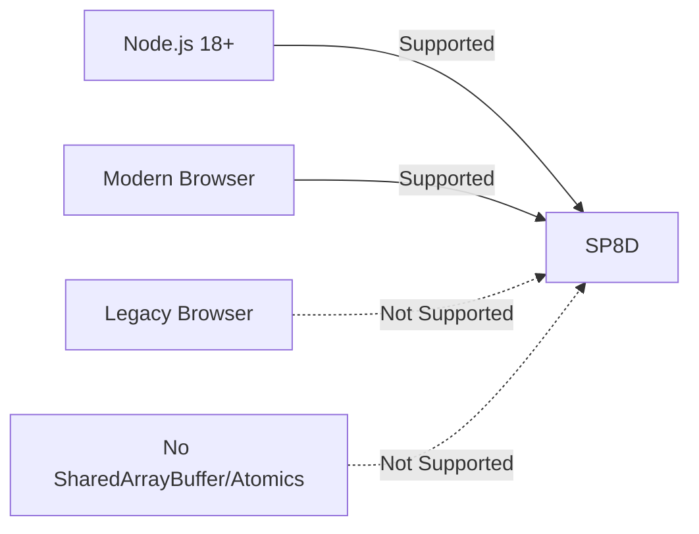
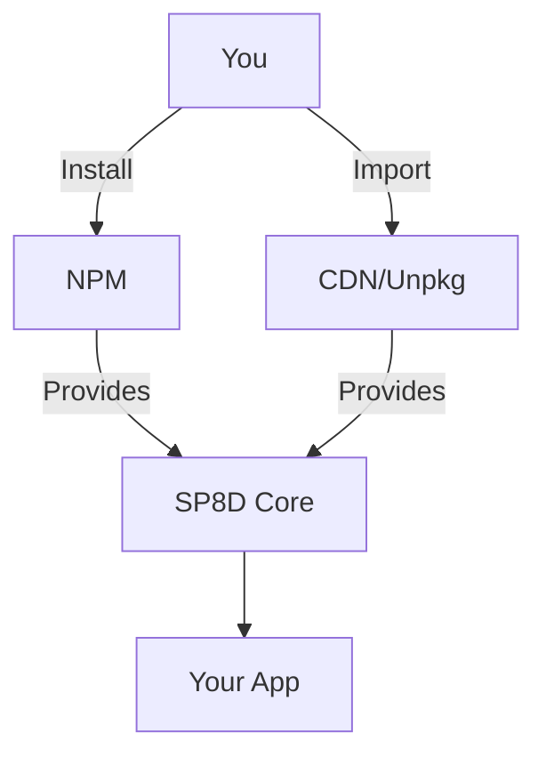

import { Callout } from "nextra/components";

# Quickstart: Installation

Get started with SP8D, the fastest lock-free protocol for cross-thread communication in JavaScript and Node.js. This guide covers requirements, installation, and troubleshooting for high-performance messaging.

# Install SP8D: Quickstart Guide for JavaScript & Node.js

Welcome to **SP8D**—the fastest, most reliable way to move data between threads and agents in your app. This guide will help you get SP8D running in your project quickly and correctly, with clear requirements and installation steps.

---

## Requirements

Before installing, ensure your environment meets the following requirements. SP8D is designed for modern JavaScript runtimes and does not require any native or C++ dependencies.

- **Node.js 18+** or any modern browser supporting [SharedArrayBuffer](https://developer.mozilla.org/en-US/docs/Web/JavaScript/Reference/Global_Objects/SharedArrayBuffer) and [Atomics](https://developer.mozilla.org/en-US/docs/Web/JavaScript/Reference/Global_Objects/Atomics).
- [Browser compatibility table →](https://caniuse.com/sharedarraybuffer)

<Callout type="warning" title="Cross-origin Headers">
  In browsers, cross-origin headers may be required for SharedArrayBuffer.
</Callout>
<Callout type="info" title="Supported Environments">
  Only modern browsers and Node.js 18+ are recommended for SP8D.
</Callout>



---

## Quickstart: Install SP8D

SP8D can be installed using NPM for production use, or loaded via CDN for prototyping and browser demos. The diagram below shows how SP8D integrates into your application stack.



<Callout type="info" title="Integration Flow">
  SP8D installation and integration flow: install via NPM for production, or
  import from CDN for rapid prototyping.
</Callout>

### NPM (Recommended)

To add SP8D to your project as a dependency, run:

```shell copy showLineNumbers
npm install @sp8d/core
```

### CDN/Unpkg (For Prototyping)

For quick browser demos or prototyping, you can import SP8D directly from a CDN:

```js copy showLineNumbers
<script type="module">
  import {createChannel} from 'https://unpkg.com/@sp8d/core?module';
</script>
```

### CommonJS

If you are using CommonJS modules (e.g., in older Node.js projects):

```js copy showLineNumbers
const { createChannel } = require("@sp8d/core");
```

<details>
<summary>Example package.json</summary>

```json
{
  "name": "my-sp8d-app",
  "type": "module",
  "dependencies": {
    "@sp8d/core": "^x.y.z"
  }
}
```

</details>

---

## TypeScript Support

<Callout type="tip" title="TypeScript Support">
  **SP8D** is written in TypeScript and ships with complete type definitions. No
  additional type packages are required.
</Callout>

SP8D is written in TypeScript and ships with complete type definitions. No additional type packages are required. This ensures seamless integration and type safety in TypeScript projects.

For a minimal TypeScript example, see: [Quickstart: Minimal Example →](/quickstart/minimal-example)

---

## Smoke Test: Verify Your Installation

<Callout type="info" title="Smoke Test">
  After installation, run this code to verify SP8D is working in your project.
</Callout>

After installation, you can quickly verify that SP8D is working as expected by running the following code in your project:

```js copy showLineNumbers
import { createChannel } from "@sp8d/core";

const { channel } = createChannel({ slots: 4, slotSize: 64 });
console.log(channel.info()); // Prints protocol details
```

For a more detailed walkthrough, see the [Quickstart: Minimal Example →](/quickstart/minimal-example) or consult the [API Reference →](/api-reference/channel-api).

---

## Next Steps

<Callout type="info" title="Next Steps">
  Once SP8D is installed, follow the minimal example, explore common recipes, or
  learn about debugging and concurrency models.
</Callout>

Once SP8D is installed, you can:

- Follow the [Quickstart: Minimal Example →](/quickstart/minimal-example)
- Explore [Common Recipes: Browser Workers, Node.js, and More →](/quickstart/common-recipes)
- Learn about [Debugging & Diagnostics →](/guides-and-howtos/faqs)
- Understand [Concurrency Models →](/principles/concurrency-models)

---

## Troubleshooting

If you encounter issues during installation or usage, consider the following.

- **“Cannot use SharedArrayBuffer”**: Ensure you are in a secure context (https:// with COOP/COEP headers). [See FAQ →](/guides-and-howtos/faqs)
- **Type errors?** Make sure you are using Node.js 18+ or a supported bundler.
- **Still stuck?** [Open an issue →](https://github.com/sp8d/sp8d-core/issues)

---

_Last updated: 14 May 2025_

---

**Next: [Run the SP8D Minimal Example →](/quickstart/minimal-example)**
