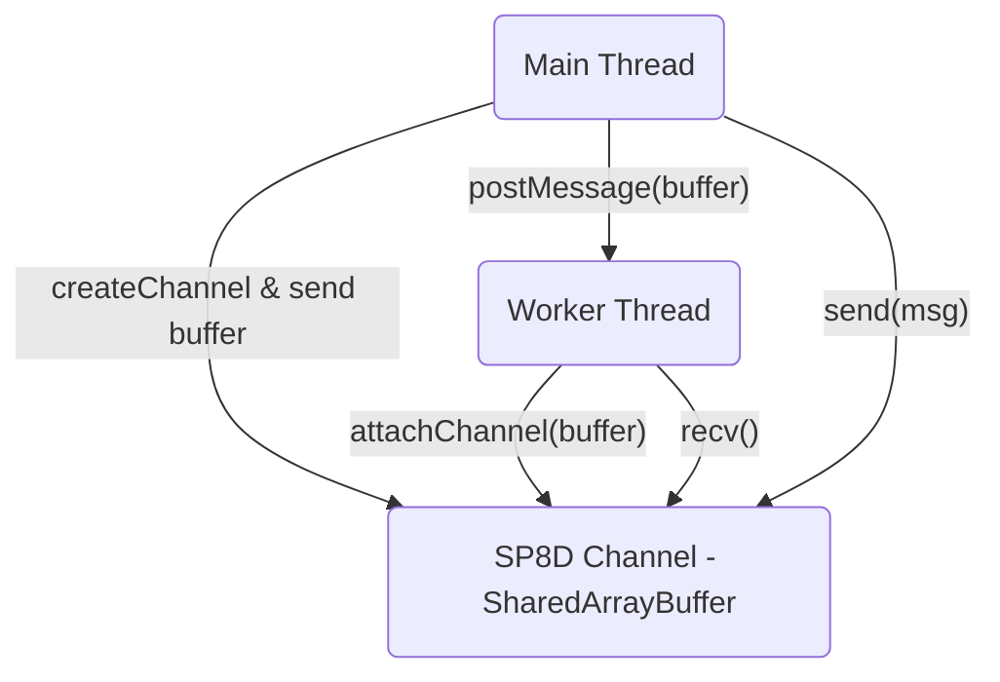

import { Callout } from "nextra/components";

# Quickstart: Minimal Example

> This is the fastest way to get a working SP8D channel in your app. For environment requirements, see{" "}
> [Installation Requirements →](/quickstart/installation#requirements).

See how to set up a minimal SP8D channel for real-time, lock-free messaging in JavaScript and Node.js. Copy-paste code for instant high-performance results.

# SP8D Minimal Example: Lock-Free Messaging in JavaScript & Node.js

---

## Minimal Example: Single Producer, Single Consumer

<Callout type="info" title="About This Example">
  The following is the most basic usage: one producer and one consumer,
  communicating via a lock-free, bounded channel. For a more complete and
  production-ready SPSC example, see{" "}
  <a href="/examples/basic-spsc">Basic SPSC Example</a>.
</Callout>

### Node.js (TypeScript)

```ts copy showLineNumbers filename="minimal-example.ts"
import { createChannel } from "@sp8d/core";

const { channel } = createChannel({ slots: 8, slotSize: 64 });
channel.send(new Uint8Array([42, 17, 8]));
const received: Uint8Array | undefined = channel.recv();
console.log("Received:", received); // Uint8Array([42, 17, 8])
```

<Callout type="tip" title="JavaScript Users">
  If you prefer <b>plain JavaScript</b>, you can use the same code without type
  annotations.
</Callout>

---

## Browser: Main Thread to Worker (TypeScript)

<Callout type="info" title="Browser Requirements">
  SP8D works seamlessly in browsers, enabling high-performance communication
  between the main thread and workers. This example uses two files: one for the
  main thread, one for the worker. Requires SharedArrayBuffer support in your
  browser.
</Callout>

```ts copy showLineNumbers filename="main.ts"
import { createChannel } from "@sp8d/core";

const { channel, buffer } = createChannel({ slots: 8, slotSize: 8 });

const worker = new Worker("worker.js");
worker.postMessage(buffer, [buffer]); // Transfer the SharedArrayBuffer

// Send a message from main
channel.send(new Uint8Array([1, 2, 3, 4, 5, 6, 7, 8]));
```

```ts copy showLineNumbers filename="worker.ts"
import { attachChannel } from "@sp8d/core";

self.onmessage = (e: MessageEvent<SharedArrayBuffer>) => {
  const channel = attachChannel(e.data);
  const msg: Uint8Array | undefined = channel.recv();
  console.log("Worker received:", msg); // Should log: Uint8Array([1,2,3,4,5,6,7,8])
};
```

<Callout type="info" title="How It Works">
  In this setup, the main thread creates the channel and transfers the buffer to
  the worker. Both sides can now send and receive messages with zero-copy
  efficiency.
</Callout>



<sub className="diagram-caption">
  <strong>Diagram:</strong> Minimal browser/worker data flow: main thread and
  worker communicate via a shared SP8D channel.
</sub>

---

## How It Works

<Callout type="info" title="Channel Mechanics">
  This section summarizes the minimal mechanics behind SP8D’s channel
  operations. For deeper details, see the relevant documentation sections.
</Callout>

- `createChannel`: Allocates a shared ring buffer of slots for your messages, with safety and backpressure.
- `send`: Producer claims a slot, writes the payload, and marks it as ready.
- `recv`: Consumer waits for a ready slot, reads the data, and frees it.
- All transitions happen atomically—no locks, ever.

---

## Why Use SP8D for Minimal Messaging?

<Callout type="success" title="Why SP8D?">
  No setup of queues, events, Promise chains, or bounce buffers. Immediate
  delivery, guaranteed boundedness, lock-free performance. No external
  dependencies beyond modern JS runtime support. Use <code>channel.info()</code>{" "}
  or <code>channel.stats()</code> to verify state and health.
</Callout>

---

## Try Live

> **Test SP8D channels interactively** in your browser. A live harness is available for experimentation and diagnostics. [Open the SP8D Harness →](https://harness.sp8d.com/)

---

## Where To Next?

- [Quickstart: Minimal Example →](/quickstart/minimal-example)
- [Quickstart: Common Integration Patterns →](/quickstart/common-recipes)
- [Diagnostics and State Overlays →](/guides-and-howtos/faqs)
- [Core API Reference →](/api-reference/channel-api)
- [FAQ →](/guides-and-howtos/faqs)
- [Open an Issue →](https://github.com/SP8D/sp8d/issues)

---

**Next: [Explore SP8D Common Integration Recipes →](/quickstart/common-recipes)**
